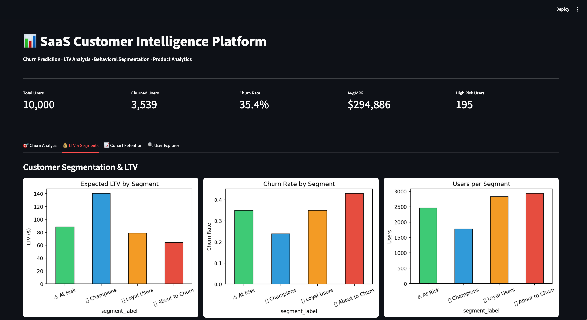
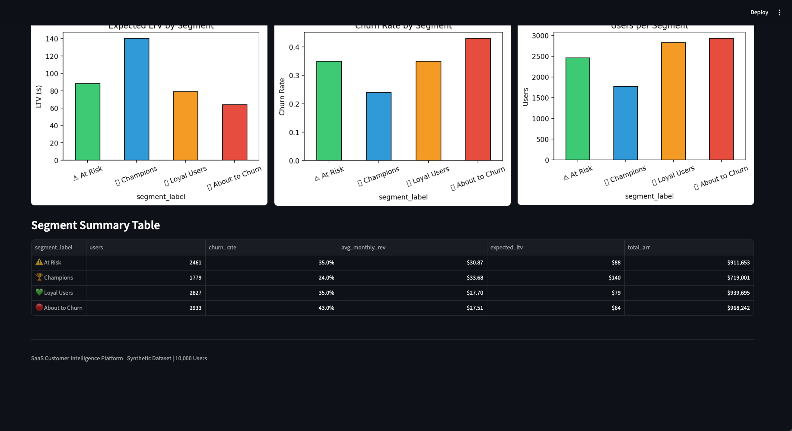
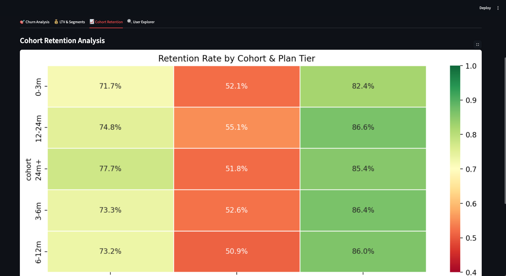
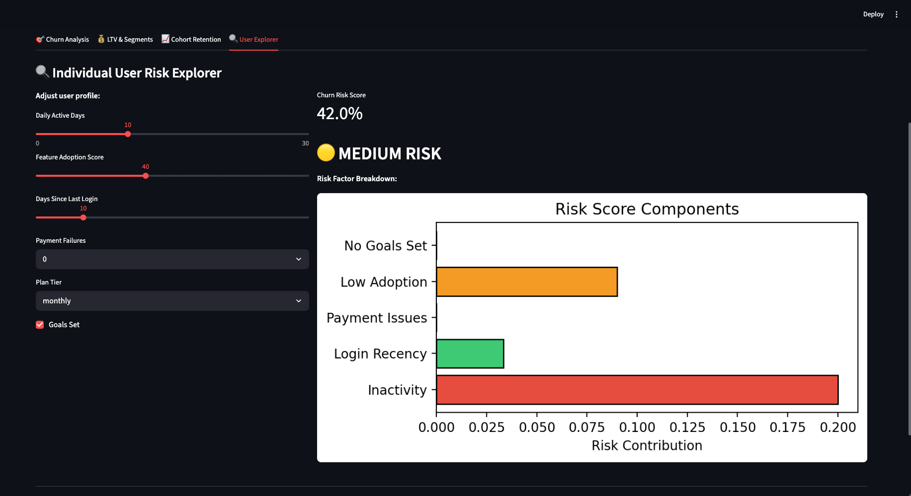

# SaaS Customer Intelligence Platform

Customer analytics project for churn prediction, lifetime value analysis, segmentation, cohort retention review, and dashboard-based exploration. The repository uses a synthetic SaaS dataset to demonstrate a realistic end-to-end analytics workflow.

## Overview

The project is organized around four core product questions:

- Which customers are most likely to churn?
- Which segments generate the most value?
- How does retention vary by plan and cohort?
- What product or onboarding interventions look promising?

## Workflow

```text
Synthetic SaaS user dataset
  -> feature engineering and RFM scoring
  -> segmentation and LTV estimation
  -> cohort retention analysis
  -> churn modeling and SHAP interpretation
  -> Streamlit dashboard
```

## Dashboard Screenshots

### Overview and KPIs


### LTV and Segments


### Cohort Retention


### User Explorer


## Key Results

### Business KPIs
| Metric | Value |
| --- | --- |
| Total Users | 10,000 |
| Churned Users | 3,539 |
| Overall Churn Rate | 35.4% |
| Monthly Recurring Revenue | $294,886 |
| High Risk Users | 195 |

### Churn Model Performance
| Metric | Value |
| --- | --- |
| Cross-validation AUC | 0.673 +/- 0.008 |
| Test AUC | 0.643 |
| Dataset | Synthetic, 10,000 users and 16 features |

### Customer Segments
| Segment | Users | Churn Rate | Expected LTV | ARR |
| --- | --- | --- | --- | --- |
| Champions | 1,779 | 24.0% | $140 | $719,001 |
| At Risk | 2,461 | 35.0% | $88 | $911,653 |
| Loyal Users | 2,827 | 35.0% | $79 | $939,695 |
| About to Churn | 2,933 | 43.0% | $64 | $968,242 |

## Technical Stack

| Layer | Tools |
| --- | --- |
| Data generation | NumPy, Pandas |
| Segmentation | K-Means, RFM analysis |
| LTV modeling | Revenue and churn-rate based estimates |
| Churn prediction | XGBoost, Stratified K-Fold CV |
| Explainability | SHAP |
| Experimentation | SciPy A/B testing |
| Tracking | MLflow |
| Dashboard | Streamlit |
| Visualization | Matplotlib, Seaborn |

## Repository Structure

```text
saas-churn-ltv/
|-- data/
|   |-- saas_users.csv
|   |-- segment_stats.csv
|   |-- cohort_retention.csv
|   |-- eda_plots.png
|   |-- segmentation_ltv.png
|   |-- cohort_ab_test.png
|   |-- shap_churn.png
|   `-- confusion_matrix.png
|-- src/
|   `-- app.py
|-- requirements.txt
`-- README.md
```

## Installation

```bash
git clone https://github.com/pavankalmanoor/saas-churn-ltv.git
cd saas-churn-ltv
python3 -m venv .venv
source .venv/bin/activate
pip install -r requirements.txt
```

## Running the Dashboard

```bash
streamlit run src/app.py
```

## Notes

The dataset is synthetic by design. That makes the project appropriate for portfolio work and product analytics demonstration, but the churn model metrics should not be interpreted as claims about a live production customer base.
